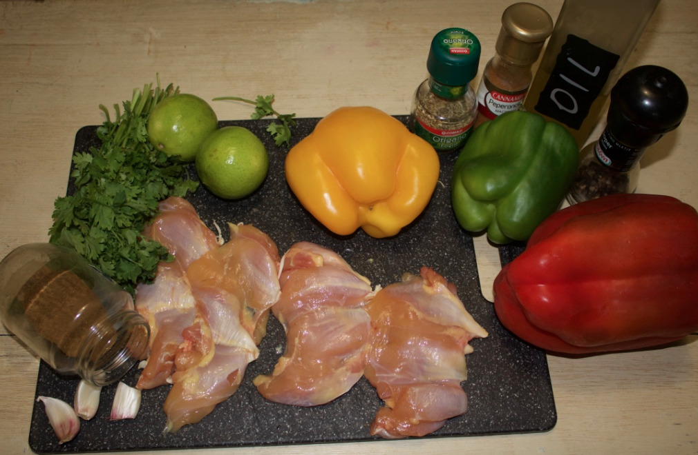

Baked chicken rolls, fajitas version
====================================

- Serves: 4

- Type: main dish

Description
-----------
This is a low-carb recipe for mexican food lovers.

Ingredients
-----------

- Chicken filet: 4
- Lemon: 1
- Fresh cilantra (coriander): 3 tablespoon (after chopping)
- Red pepper: half
- Green pepper: half
- Yellow pepper: half
- Chili powder: half teaspoon
- Cumin: one teaspoon
- Garlic cloves: 3
- Dried oregano: half teaspoon (after chopping)
- Olive oil: 2 tablespoon
- Salt: 1 teaspoon
- Pepper: 1 teaspoon

    Ingredients

Steps
-----
#. Chop the cilantra (coriander).

    .. figure:: _static/chicken_rolls_cut_coriander.jpg

        Chop the cilantra

#. Chop the garlic cloves.
#. Take a bowl and put in it the cilantra, garlic, lemon juice, salt, pepper, oregano, and olive oil.

    .. figure:: _static/chicken_rolls_add_coriander.jpg

        Add coriander

#. Cut the lemon in two halves and squeeze the juice out into the bowl.

    .. figure:: _static/chicken_rolls_squeeze_lemon.jpg

        Squeeze the lemon

#. Add the chicken filets (it is assumed they have been cleaned) in the bowl. Let it marinate for at least one hour. Move the chicken every ten minutes to help all sides of the filets to be properly marinated.

    .. figure:: _static/chicken_rolls_marination.jpg

        Marinate the chicken

#. Preheat the oven to 175 degrees Celcius (347 degrees Fahrenheit).
#. Cut the peppers in slices of about 3mm wide.

    .. figure:: _static/chicken_rolls_cut_peppers.jpg

        Cut the peppers

#. After the chicken has been marinated, take it from the bowl and place the slices peppers on top of the chicken. 
#. Roll the filets and use a toothpick to avoid them from un-rolling.

     .. figure:: _static/chicken_rolls_cut_rolling.jpg

        Roll the chicken filets with the peppers inside

#. Place the chicken rolls in an oven dish and sprinkle with the remaining marination juice. 

     .. figure:: _static/chicken_rolls_before_oven.jpg

        Prepare the chicken rolls for the oven

#. Place the oven dish with the chicken rolls in the oven and let it cook for 25 to 30 minutes, or until the chicken is cooked, at 175 degrees Celcius.

     .. figure:: _static/chicken_rolls_after_oven.jpg

        The chicken rolls after cooking in the oven

Can be served with
------------------
- salad
- avocado slices

