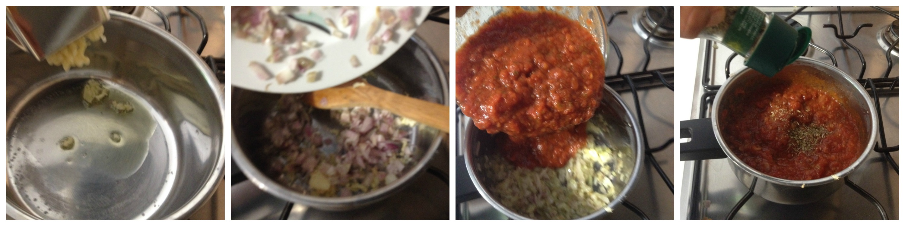

Tomato marinara sauce
=====================

- Type: other

Background
----------
This is for excellence the "Italian sauce". It can be used to be served with several plates (grilled vegetables, meatballs, fish, etc) and can be used as basic sauce for other pasta sauces: tuna, olives, chili.  

Ingredients
-----------
- 500 millimetres tomato sauce
- 2 scallion
- 3 garlic gloves
- 1 teaspoon dry origano
- 1 teaspoon dry basil
- olive oil

Steps
-----
#. Sliced the garlic gloves and the scallions 
#. Heat in a pot the olive oil
#. Add the garlic and stir continuously being careful to do not brown them
#. Add the diced scallions and cooked to blanch them, add salt and pepper
#. Pour the tomato sauce and add both the dry origano and basil
#. Add a splash of olive oil, cover with a lid and cook for 3-5 minutes with low heat.

preparing the Tomato marinara sauce

Can be served with
------------------
- Spaghetti
- Meatballs
