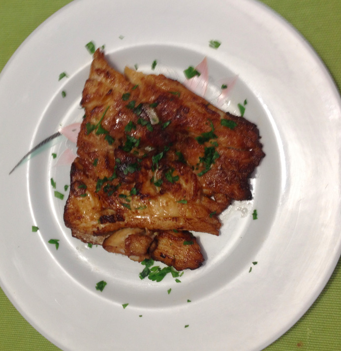

Fried perch filet with garlic
=============================

- Serves: 2

- Type: main dish

Background
----------
This recipe is adapted from a traditional Peruvian seafood recipe. According to Peruvian tradition, it is typically eaten together with fried yucca root.

Ingredients
-----------

- fish filet from perch (Perca fluviatilis), corvina (Cilus gilberti) or brassy grunt (Orthopristis chalceus): 400 g
- garlic: 8 cloves
- pepper: 1 teaspoon
- salt: 0.5 teaspoon
- soya sauce: 2 tablespoon
- seed oil (preferable: from grape seeds) : 400 ml or more, depending on size of pan and fish

- Optional:

    + parsley, for decoration

Steps
-----

#. Take one garlic clove and cut it in two parts. It is used later to scrub the fish with the internal side of the garlic.
#. Chop the remaining garlic in fine slices.

    .. figure:: _static/perch_garlic_soya_sauce.jpg

		Use slices of garlic, and soya sauce

#. Clean the fish using streaming water, then dry with kitchen paper. Make sure to remove any fish bones, if present.
#. Cut the filet in two halves.
#. Scrub the fish with the cut piece of garlic.
#. Make shallow, oblique incisions on the sides of the filet. These will contain the garlic.

    .. figure:: _static/perch_incisions.jpg

		Make small incisions on the side of the fillet
		
#. Season both sides of the fish with Pepper and salt.

    .. figure:: _static/perch_pepper.jpg

		Pepper the fish

#. Fill the fish's incisions with the pieces of garlic.

    .. figure:: _static/perch_with_garlic_incisions.jpg

		Fish with garlic slices place in incisions

#. Add remaining garlic to the soya sauce, and bath the fish in the sauce. Leave the fish in the sauce for five minutes.
#. Heat the oil in a pan, without burning it.
#. Add the fish in the pan and fry it. It is preferred to submerge the fish in the oil. Keep the fish in the oil for about 5 minutes. If there is insufficient oil to submerge the fish, flip the fish halfway

    .. figure:: _static/perch_fried.jpg

		Fry the fish in seed oil

#. Place kitchen paper on a place, then place the fish on the kitchen paper to absorb the oil. Optionally, add parsley for decoration.

