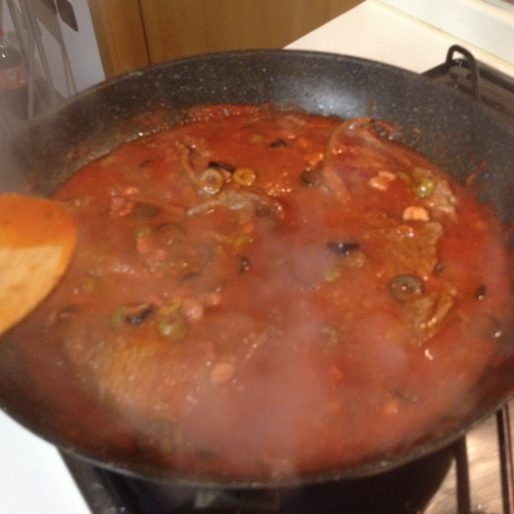

Pizzaiola  veal steak
=====================

- Serves: 2

- Type: main dish

Description
-----------
This is a classical Italian plate serve with roasted potatoes or bread, but since we are avowing high carbs we served it with some grilled zucchini or sweet potatoes.

Ingredients
-----------

- 4 thin veal beefsteak
- 10 Green pitted olives entire or in slices*
- 10 Black pitted olives entire or in slices*
- 250 ml tomato sauce
- Fresh ground pepper
- Salt to taste
- 3 Garlic cloves or 1 tablespoon of garlic paste
- Dried oregano: half teaspoon
- Extra vergine olive oil: 2 tablespoon
- 100 grm diced bacon
- Meat broth (approx. 150 ml to 200 ml)

* minimum quantity

Steps
-----
#. Wash and dry with kitchen paper the veal steaks, wrap one by one of them in greaseproof paper and hit the meat softly with a kitchen hammer (I prefer the wooden one). This procedure will make the veal steak soft, my advise is always to use defrosted meat, this is because the meat fiber breaks and it becomes softer, if you have fresh meat, hitting it will make it even softer. 

    .. figure:: _static/pizzaiola_beefsteak01.jpg

    .. figure:: _static/pizzaiola_beefsteak02.jpg

    .. figure:: _static/pizzaiola_beefsteak03.jpg

        Making the veal steaks softer.

#. Chop the garlic cloves (if you are using garlic cloves, in case, skip this step).
#. Slice the pitted olives 

	.. figure:: _static/pizzaiola_beefsteak04.jpg

	.. figure:: _static/pizzaiola_beefsteak05.jpg

#. Heat the extra vergine olive oil in a fry pan,
    
	.. figure:: _static/pizzaiola_beefsteak06.jpg

        Heat the olive oil

#. Add the garlic cloves or the garlic paste and stir, the garlic does not have to burn! (if the garlic burns your food will have a bitter taste and it is better to avoid it).

    .. figure:: _static/pizzaiola_beefsteak07.jpg

       Add garlic

#. Add the tomato sauce, salt, pepper, origano and diced bacon (if you prefer you can stir fry it with the garlic in the previous step)

    .. figure:: _static/pizzaiola_beefsteak08.jpg
    .. figure:: _static/pizzaiola_beefsteak09.jpg
    .. figure:: _static/pizzaiola_beefsteak10.jpg

       Add the tomato sauce, spices and bacon

#. Add the sliced olives.

    .. figure:: _static/pizzaiola_beefsteak11.jpg

#. Add the veal steaks and cook with moderate heat all together - flipping the meat any 5 minutes - for 15 minutes if the steaks are thin or 20 minutes if they are thick stirring the tomato marinara. Avoid that the marinara sauce becomes dry by adding the meat broth little by little. 

    .. figure:: _static/pizzaiola_beefsteak12.jpg
    .. figure:: _static/pizzaiola_beefsteak13.jpg
    
	Add the veal steaks and cook them in the tomato marinara

#. Taste the salt and origano, in case add more.

    .. figure:: _static/pizzaiola_beefsteak14.jpg

	Buon appetito! 

Can be served with
------------------
- grilled vegetables (zucchini and eggplant) 

