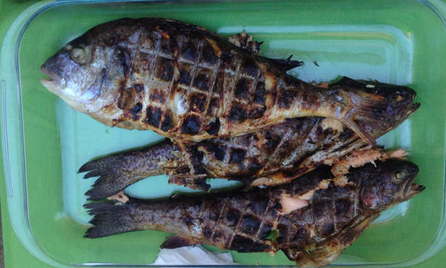

Trout and see bream barbeque
============================

- Serves: 2

- Type: main

Note
----
This recipe describes a barbeque with to fish species, trout and sea bream. They can also be prepared independently.

Ingredients
-----------

- Trout (one per person)
- Sea bream (one per two people)
- Rosemary
- Garlic
- Salt: 1 tablespoon
- Black pepper: 1 teaspoon

Tools
-----
- Barbeque
- Two-side steel grid for barbeque

Steps
-----
#. If the fish still have their guts, remove them first after making a cut in the ventral (belly) side. 

    .. figure:: _static/sea_bream_ventral_cut.jpg

		Ventral cut used to remove the guts

#. Wash the fish, and dry them with paper afterwards
#. Cut the garlic in slices.
#. For the sea bream, make *garlic pockets* by making cuts laterally (on the sides). 

    .. figure:: _static/sea_bream_lateral_cuts.jpg

        Lateral cuts for garlic

    Place the garlic in these lateral pockets and also in the ventral incision.

    .. figure:: _static/sea_bream_garlic_pockets.jpg

        Garlic pockets

    Place the garlic in these lateral pockets and also in the ventral incision.
  
#. For the trout, sprinkle dry rosemary on both sides and also in the ventral incision.

	.. figure:: _static/trout_rosemary_lateral.jpg

        Add rosemary on both sides

	.. figure:: _static/trout_rosemary_ventral_cut.jpg

        Add rosemary in the ventral incision

#. For both fish, add salt and black pepper on both sides and also in the ventral incision.

	.. figure:: _static/sea_bream_pepper_ventral_cut.jpg

        Add salt and pepper in the ventral incision

#. Place the fish in the grid

    .. figure:: _static/trout_and_sea_bream_grid_twosides.jpg

		Place the fish in the grid

#. Place the grid with the fish on the barbeque

   .. figure:: _static/trout_and_sea_bream_on_barbeque_early.jpg

        Fish on the barbeque

#. Cook for about 10 minutes for each side.

   .. figure:: _static/trout_and_sea_bream_on_barbeque_late.jpg

        Fish after cooking on the barbeque ready

#. Remove the fish from the barbeque.

	.. figure:: _static/trout_and_sea_bream_remove_from_barbeque.jpg

		Remove the fish from the barbeque

